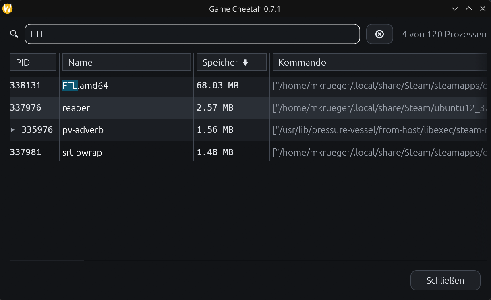
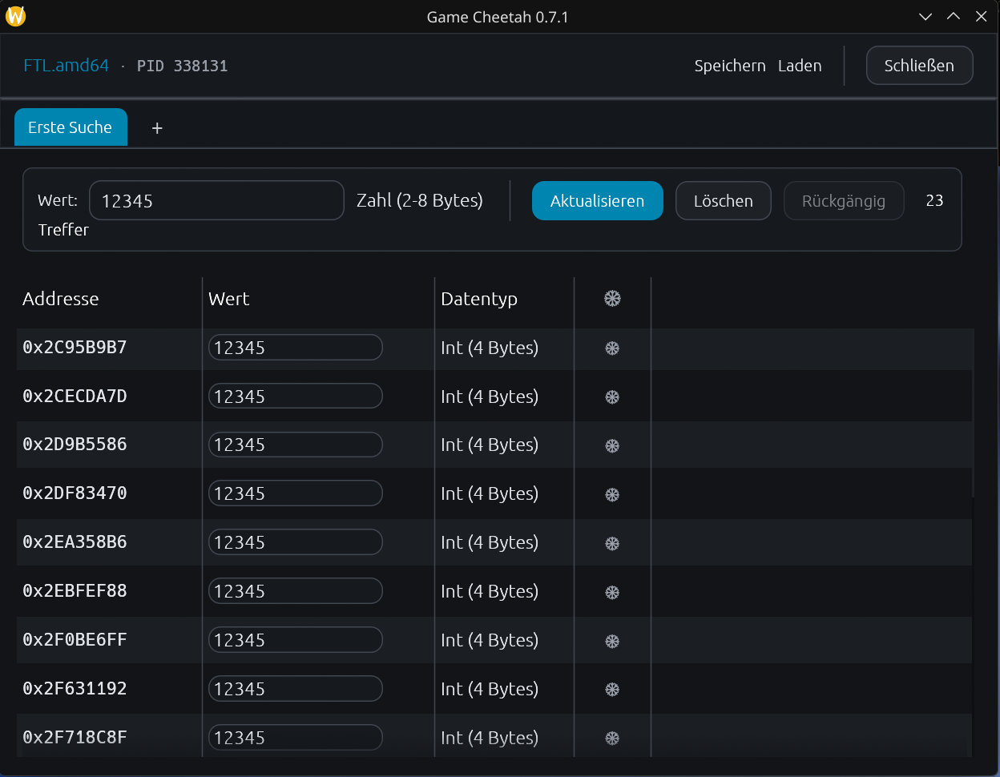
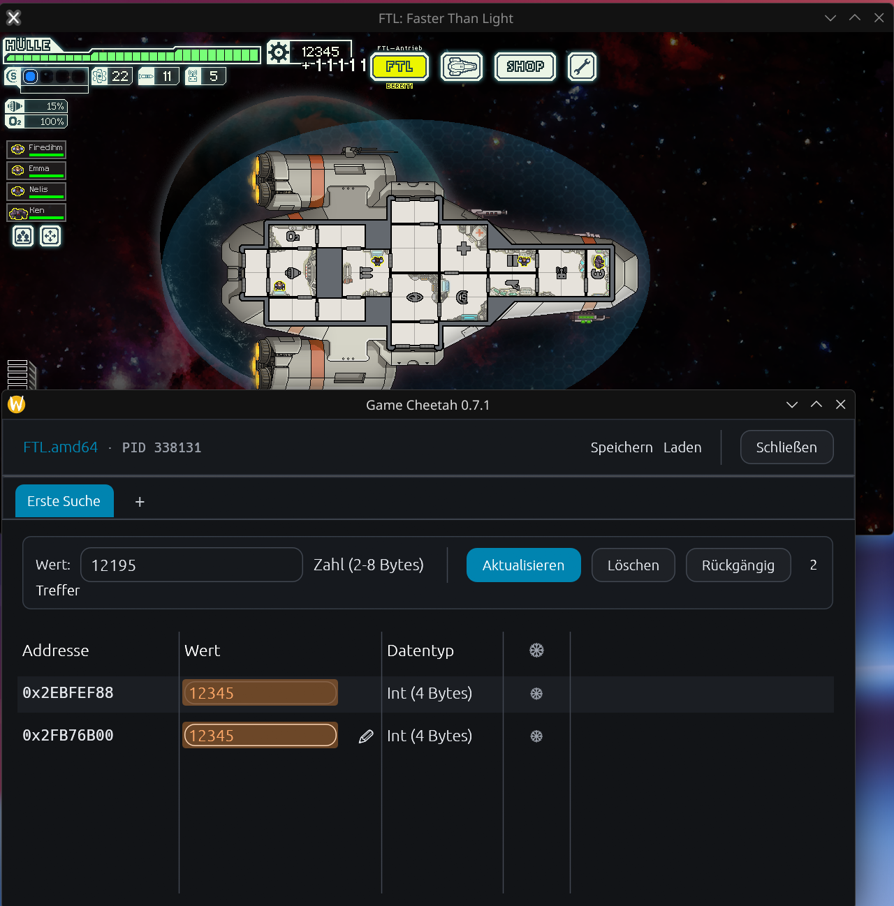
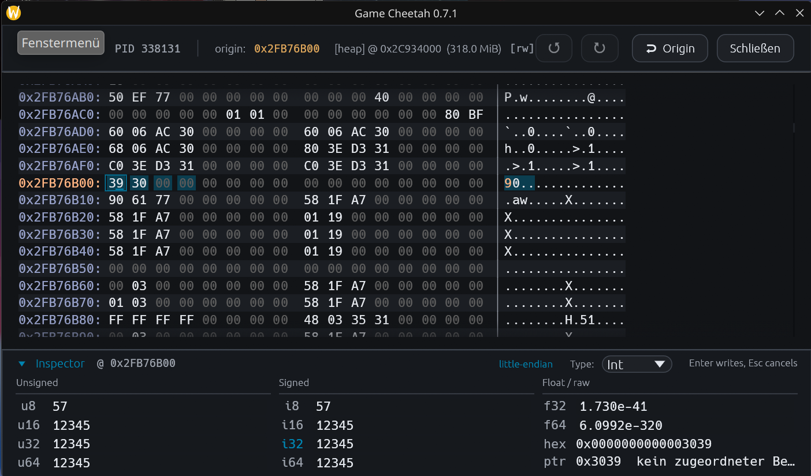

#  Game Cheetah

**Game Cheetah** is a fast, cross-platform memory scanner and game trainer for Linux, Windows, and macOS.

Use it to search values in a running process, narrow down result sets, edit memory, and freeze values. Cheat tables are **EXPERIMENTAL OPT-IN**, disabled by default under **Settings → Persistence (UNSAFE)**. It is intended for single-player/offline games, debugging, reverse engineering, game modding, and educational use.

> Modifying another process can crash the target application or behave unpredictably. Use at your own risk. Game Cheetah is not intended for cheating in online or multiplayer games.

## Features

- **Cross-platform desktop app**
  - Linux, Windows, and macOS support
  - Native GUI built with Rust, `egui`, and `eframe`
  - English and German localization
- **Fast memory scanning**
  - Search integers, floats, doubles, strings, UTF-16 strings, byte arrays, and unknown values
  - Narrow results with exact, changed, unchanged, increased, decreased, and guessed-value workflows
  - Parallel search and SIMD-aware code paths where they help
  - Memory-region filtering to skip irrelevant or unsafe regions
- **Live process editing**
  - Expand grouped process entries to attach to a specific process instance
  - Edit search results directly in the result table
  - Freeze individual values or the complete result set
  - Changed-value highlighting for live rows
  - Multiple search tabs for independent searches
- **Memory editor**
  - Adaptive hex and ASCII view that fills the available width
  - Direct byte inspection and editing with keyboard navigation
  - Collapsible numeric inspector with little-/big-endian interpretation
  - Hex and mapped-pointer views plus result-type selection
  - Undo/redo and selected-result range highlighting
- **Cheat tables and workflow helpers**
  - **EXPERIMENTAL OPT-IN:** save/load cheat tables, address definitions, and pointer scanning; enable **Settings → Persistence (UNSAFE)** (default off)
  - Rename, close, and manage searches
  - Auto-reconnect to a process with the same name after restart
  - Optional update checks against GitHub releases

## Numeric limits and result filters

Result values are written live by default. Enable **Write values only on Enter**
in **Settings** to buffer result-table edits until Enter; Escape or leaving the
field discards unconfirmed input. This option is off for new and existing users.
The memory inspector's existing Enter-to-write behavior is unchanged.

`Int` is a signed 32-bit integer, limited to −2,147,483,648 through 2,147,483,647.
This is a storage limit, not an artificial digit limit. For example, if a game
stores resources scaled by 100,000, a displayed 18,000 is stored as 1,800,000,000.
Do not assume that a larger resource count can safely be written by selecting a
wider type: writing eight bytes to a four-byte variable can overwrite its neighbor.
Use **Check data type…** when an edit is invalid, or click a result's type cell
to inspect the address. Type changes remain manual and reinterpret the same memory.

**Number / Guess** tries Int32 plus Float32 and Float64. For integer input outside
the signed Int32 range, Int64 replaces Int32; both integer widths are never tried
together. This avoids duplicate Int32/Int64 hits for small values. Select **Int64**
explicitly when searching for a small value known to occupy eight bytes. Guess is
a heuristic, not reliable identification of the game's variable type; floating-point
interpretations can still match the same address (for example for zero).

After a numeric search, expand **Filter results** beside **Undo** and **Reset search**.
Choose `=`, `≠`, `<`, `≤`, `>`, `≥`, or **between**, then **Apply filter**.
For example, `≥ 0` removes negative values; **between 1000 and 5000** keeps both
endpoints. All current results are checked, even when the table is hidden.

Filters read current memory without writing it. Like other narrowing passes, they
release this search's freezes; **Undo** restores the result set, not freezes.
Unknown-value comparisons retain their previous comparison baseline. Bounds accept
Int64 integers or finite decimal numbers with a decimal point and optional exponent.
Comparisons are exact, not epsilon-based; Float32 bounds use Float32 precision.
The numeric value filter excludes unreadable, non-numeric and non-finite values.

Each filter can be enabled independently; enabled filters are combined:
- **Data types** keeps only selected interpretations (UInt8, Int16, Int32, Int64,
  Float32, Float64), without changing types or writing memory. Use **None** then
  select a type to keep only that type.
- **Stable values only** observes matching results for 3 seconds by default
  (adjustable from 1 to 30 seconds). Every observed byte change or failed read
  permanently removes that candidate, even if it subsequently returns to its old value.
  Observation starts after **Apply**, not retrospectively. Sampling is roughly
  every 200 ms, slower for large lists; changes between samples can be missed.
  **Cancel and restore results** aborts the observation and restores the previous
  result set. Freezes belonging to other searches remain active and can make
  a value appear stable.

## Saved addresses — EXPERIMENTAL OPT-IN

**All persistence features below require Settings → Persistence (UNSAFE), which is
off by default.** This includes **Save / Load**, **Edit address…**, module-relative
and pointer-chain definitions, automatic pointer chains on Save, and the advanced
scanner's candidate save/load and adoption actions. These features remain available
after explicit opt-in; they are not removed. Their buttons and result-menu entries
are hidden while disabled. Normal searching, live value editing, copying, freezing,
and the memory editor do not require persistence.

**UNSAFE: persistence does not guarantee restart safety.** A saved address or a
currently readable pointer chain can resolve to the wrong object, even after a
successful restart check. Independently verify the intended object and value before
writing or freezing; readability or an equal value alone is not proof.

Disabling persistence cancels saving/scanning, closes the address editor and scanner,
and clears tabs' results, address metadata, pending entries and Undo history where
persistent definitions are present, releasing their freezes. Ordinary search tabs
remain intact. Existing saved files are not deleted.

When enabled, the **Save** / **Load** buttons use cheat-table format 2 for absolute/module
addresses, or format 3 when pointer chains are present. Versions 1 and 2 still load;
older Game Cheetah releases cannot read the newer formats.

- **Save** automatically stores recognized image-backed results as a module path
  plus hexadecimal offset. The offset is relative to the image base, not its
  writable segment. For absolute numeric results, it now automatically searches
  for a pointer chain in the background, without opening the scanner dialog.
  Existing module/pointer definitions and unresolved entries are preserved;
  no freezes are stored.
- Right-click a result and choose **Edit address…** to select **Absolute** or
  **Module-relative**, choose/type a module and edit the hex offset. The editor
  previews resolution; applying changes the address, not process memory, and
  releases this tab's freezes. **Undo** restores the previous definition.
- **Load** resolves modules against the attached process. Missing, ambiguous or
  out-of-range definitions remain in **Unresolved addresses**, where they can be
  edited, retried or removed. They are included when saving again and are never
  substituted with a stale absolute address.
- Module paths match exactly; a manually entered filename is accepted only when
  unambiguous. After a process reconnect, module entries are resolved anew and
  old absolute results require explicit correction/confirmation. Loading an old
  absolute table remains supported, but those addresses are not restart-safe.
- Module mappings are refreshed periodically. Module-backed writes and freezes
  validate the current mapping; invalid freezes stop with a notification. No
  freeze is automatically re-enabled after re-resolution. An OS mapping can still
  change between validation and access; this is not an atomic guarantee.

Module-relative definitions can compensate for ASLR; this is not a guarantee of
correct targets across restarts or game updates. Updated binaries can change offsets
and data layouts even when an address remains readable. Heap allocations and
anonymous BSS mappings are intentionally not assigned to nearby modules by guesswork.
Live value writing remains the default; the optional Enter confirmation is unchanged.

### Manual pointer chains — EXPERIMENTAL OPT-IN

With **Settings → Persistence (UNSAFE)** enabled, right-click a result → **Edit address…** → **Pointer chain**. Supply a known module
and base offset, explicitly select the target process's **32-bit or 64-bit pointer
width** (independent of the value type), and enter offsets in traversal order.
Offsets are hexadecimal, separated by commas, whitespace or semicolons. Negative
offsets such as `-0x10` are supported. The editor shows the resolved target and
expandable intermediate steps; **Check chain now** refreshes the module list.

For base `game.exe + 0x123400` and offsets `0x80, 0x34`, resolution means:
1. Read a pointer at `module_base + 0x123400`.
2. Add `0x80`, read the next pointer at that address.
3. Add `0x34`. This address contains the value; do **not** dereference it again.

A single offset `0` means one dereference without an added offset. Chains allow
1–16 dereferences and little-endian pointers. The root must lie in a recognized
module mapping; targets may lie in heap memory. Short reads, null pointers,
overflow and unreadable final values fail closed, without using a previous target.

Pointer definitions are retained by Save/Load, Undo and reconnect while persistence
is enabled, including temporarily unresolvable objects; the stored definition is
not a guarantee that it still identifies the intended object. Targets refresh roughly every 100 ms outside the address
editor, and pointer reads/writes/freezes validate the chain again. On a changed or
broken target, existing freezes stop rather than silently transferring to another
object. Check the new target before re-enabling a freeze. The target can still
change between validation and access; resolution is not atomic with the game.

Use separate search tabs for scans and numeric/type/stability filters: tabs with
pointer definitions reject these raw-address operations. Removing all pointer
entries restores normal searching. Game updates can invalidate pointer paths.

### Automatic pointer chains on Save — EXPERIMENTAL OPT-IN

Enable **Settings → Persistence (UNSAFE)**, find the desired numeric values, then
click **Save**. Automatic selection is an unverified heuristic, not restart-safe
address discovery. The target executable
determines pointer width (little-endian ELF, PE or thin Mach-O, not the value type
or host architecture). Progress and **Cancel saving** appear above the search tabs.
Save takes a snapshot of the current table; current search tabs and game values
are not changed. **Load** uses the automatically saved chains.

For each eligible absolute result, Save prefers a short, currently valid chain
rooted in the **game executable**, not incidental allocator/system-library
references. It checks the selected chain again before writing. Existing module
and pointer entries need no new scan. Unresolved entries are never scanned or
silently repaired using an old address.

Automatic work is bounded to eight distinct address/type targets, sequentially,
using default scanner limits (512 MiB per target, depth four, offset `0x1000`).
No match, unsupported executable format, unreadable memory, strings, or targets
beyond that limit remain absolute. A persistent completion notice reports the
automatic chain count, remaining session-only addresses and partial searches.
The manual scanner below remains available for advanced settings and validation.

The previous file is only replaced **atomically after completion**. Cancelling,
resetting results, loading another table, or switching/exiting the process cancels
the save; the old file remains intact. A failed file write also preserves it.
**A chain found in one session is not proof of restart stability.** Check loaded
values after a restart before writing/freezing; game updates or object replacement
may invalidate even a chain whose target remains readable.

### Advanced pointer scanning and restart checks — EXPERIMENTAL OPT-IN

Requires **Settings → Persistence (UNSAFE)**. Restart checks only filter candidates;
they do not establish that a chain is safe to write or freeze in future sessions.

1. Find a working numeric result. Right-click it and choose **Find pointer chains…**.
2. Explicitly select **32-bit or 64-bit pointers** for the target process, not the
  value type. Set the maximum depth and hexadecimal offset, then **Search new chains**.
3. **Save candidates** to preserve the list across Game Cheetah restarts. This uses
  a separate per-process `.pointers.toml` file beside the normal cheat table; it
  does not replace that table. The file path appears in the button tooltip.
4. Restart the game, load the desired game state, and find the value again in a
  normal search tab. Right-click the **new target** and open the scanner again.
  Candidates remain in memory when reconnecting; use **Load candidates** if needed.
5. Click **Filter candidates**. Only chains resolving to that exact new address
  with the same value type and executable path survive. An equal value somewhere
  else is not a match. Repeat across restarts and different game situations.
6. **Add to new tab** rechecks a candidate against the current target and creates
  a dedicated pointer tab. Use the normal **Save** button to persist that entry.
  No game memory is written and no freeze is enabled by scanning or adoption.

The scanner runs in the background and is cancellable. Closing its dialog or
changing/exiting the process cancels the job; previous candidates remain intact.
Failed scans likewise preserve them. Candidate settings and partial-result warnings
are saved with the list. The ordinary search result set is never replaced by a scan.

Defaults: little-endian aligned pointers in readable **writable** mappings, four
dereferences, offsets up to `0x1000`, 512 MiB scan budget, 256 candidates. Options
include unaligned pointers (including page-crossing slots), read-only mappings and
negative offsets. Hard bounds are six dereferences, `0x10000` offset, 1024 MiB,
512 candidates, four million indexed pointers, 50,000 paths and two million edges
per depth. Limits produce explicitly marked partial results, not an exhaustive list.
Smaller mappings are scanned before large ones, so a large heap does not crowd out
small globals/stacks under the byte budget. Unreadable pages are skipped, short
reads are rejected, and candidates are live-checked.
The scan is not an atomic snapshot; moving objects can invalidate paths while it runs.

Roots must lie in recognized module mappings. Anonymous BSS is still intentionally
excluded rather than attributed to nearby files by guesswork. Device/deleted mappings
are skipped. Not finding a chain does not prove that none exists. A matching chain,
especially one through allocators or system libraries, is only a candidate—not proof
of a stable game object. Even a successful restart check does not guarantee other
savegames or future game versions.

## Cancelling searches

**Cancel and restore results** is available during numeric and text scans,
snapshot capture, unknown-value comparisons, refinement and stability observation.
It restores the previous results, comparison baseline and progress state, including
large unknown-value result sets. Released freezes stay off.

Switching tabs leaves a search running; closing its tab or detaching cancels its
background work. Cancellation also releases workers waiting to deliver results.
An OS memory read already in progress may finish, but its results cannot affect
the restored state or a new search.

If the target exits or its PID is reused, searches are cancelled and restored,
all freezes are cleared, and a clear error is shown. A pass in which every attempted
memory read fails also restores the previous state instead of reporting a successful
empty result; individually unreadable regions or candidates may still be skipped.

## Screenshots

### Find a process



### Search and refine values



### Change values in a running game



### Inspect memory



## Video demo

[](https://youtu.be/ng_1LBaUS48)

## Installation

### Prebuilt binaries

The recommended installation method is to download a prebuilt package from the latest GitHub release:

https://github.com/mkrueger/game_cheetah/releases/latest

Release artifacts usually include:

- Linux AppImage
- Linux `.deb` package
- Windows x64 ZIP containing the executable
- macOS universal `.dmg`

### Install with Cargo

Game Cheetah is also published on crates.io:

```bash
cargo install game-cheetah
```

This requires Rust **1.95 or newer**. The minimum supported Rust version is also listed in `Cargo.toml` and tested in CI.

## Linux permissions

On Linux, reading or writing another process is controlled by the operating system. Game Cheetah can usually inspect processes owned by the same user, but some distributions restrict this through Yama `ptrace_scope`.

If Game Cheetah cannot open or read a process, check:

```bash
cat /proc/sys/kernel/yama/ptrace_scope
```

For local development or personal single-user systems, you can temporarily relax this setting with:

```bash
echo 0 | sudo tee /proc/sys/kernel/yama/ptrace_scope
```

Changing this setting affects system security. Prefer the least-permissive setup that works for your use case.

## Build from source

Install Rust from https://www.rust-lang.org/tools/install, then run:

```bash
cargo build --release
```

The executable will be created at:

```bash
target/release/game-cheetah
```

On Linux, you may need development packages for native GUI, audio, and windowing dependencies. On Debian/Ubuntu-like systems, the CI build uses:

```bash
sudo apt install libgtk-3-dev libasound2-dev libxcb-shape0-dev libxcb-xfixes0-dev
```

## Development

To preview the process picker directly, run `cargo run -- --processes`.
Single-click selects a row; double-click, Enter, or **Connect** attaches.
Use the arrow keys to navigate and Ctrl/Cmd+F to return to the filter.

Common checks:

```bash
cargo fmt --all -- --check
cargo clippy --all-targets --all-features --locked -- -D warnings
cargo test --all-features --locked
```

GitHub Actions runs Linux formatting/lint checks and tests on stable Rust, plus
native Windows/macOS builds and tests. A separate Linux matrix entry builds all
targets and runs the tests with the pinned minimum Rust version. Linux release
guard tests also require Bash and `jq` (available on GitHub's Ubuntu runners).
Dependency auditing runs in its own workflow.

Release packaging runs for version tags, or manually for an existing tag. Before
opening a release draft or building packages, the workflow verifies that the tag
is exactly `v` followed by the Cargo package version. All package builds use
`--locked`; Debian packaging uses a pinned, lockfile-resolved `cargo-deb` install.
The published application version is not changed automatically when tagging.

## Similar tools

Game Cheetah is similar in spirit to Cheat Engine, ArtMoney, and GameGuardian, with a focus on Rust, performance, safety, and cross-platform desktop support.

## License

Game Cheetah is licensed under the Apache License 2.0.
